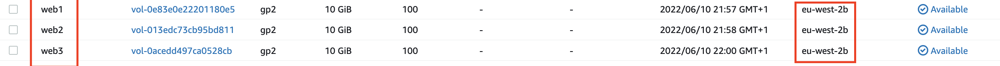
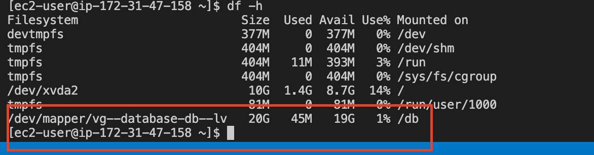

## WEB SOLUTION WITH WORDPRESS

#### Creating the webserver instance & volumnes

- I started by creating a new EC2 instance with redhat operating system named "webserver"

- I then created 3 volumes under this instance

- I proceeded to attach each of the 3 volumnes to my webserver instance

- I then connected to my EC2 instance from the terminal

- I ran the command `lsblk` and verified that these volumes that were created were attached to my system per below:

- running `ls /dev` shows me the three devices are mounted per below:

##### configuring the partitions

`sudo gdisk /dev/xvdf`

- type `n` to create a new partition and then enter

- For partition number enter `1`

- First sector means the size you want the disk to occupy (note that the max is 10gb so you can enter any number from 1 - 10) However, we want to use the entire disk so `press enter`

- Last sector is similar to above.. press enter

- Current type is the linux file system but we want to change this to logical volume management.. so enter `8e00` You will see it change to Linux LVM

- Enter command `p` to check the changes you have made

- Enter `w` to write   and enter `y` to confirm 

Repeat above for the remainging two disks below:

`sudo gdisk /dev/xvdg`

`sudo gdisk /dev/xvdh`

Type command `lsblk` to confirm the configuration and see the changes to the partition you have made per above. The physical volumes will be created on the partions `xvdf1` `xvdg1` and `xvdh1`

The next step is to install the logical volumes:

(Note that when using ubuntu, `apt` is used to install packages but in redhat which we are using for this project, we will be using `yum`)

Type `sudo yum install lvm2 -y` (note that -y helps to install automatically)

(you can type `which lvm` to show you where its been installed)

run `sudo lvmdiskscan` to check for available partitions

The next step is to create a physical volume:
Note that physical volumes cannot be created directly on the devices/disks, they will have to be created on the partions `xvdf1` `xvdg1` and `xvdh1` and as such, the command `pvcreate` is used to mark each of 3 disks as physical volumes (PVs) to be used by LVM. Hence, run the following commands:

`sudo pvcreate /dev/xvdf1`
`sudo pvcreate /dev/xvdg1`
`sudo pvcreate /dev/xvdh1`

To verify that the physical volumes have been created successfully, run `sudo pvs`

The logical volume cannot be created on a single physical volume. It needs to reside in a volume group and as such, `vgcreate` utility  is used to add all 3 physical volumes (PVs) to a volume group (VG). Name the VG `webdata-vg`. Do this by running the code below:

`sudo vgcreate webdata-vg /dev/xvdh1 /dev/xvdg1 /dev/xvdf1`

Verify that the volume group has been created by running the code:

`sudo vgs`

(note a volume group is when a number of disks have been brought together as one. So physically, each of these disks are 10gb but logically, they have been concanated into a single logical volume of 30gb)

THe logical volume can then be created on the volume group. The logical volume is what is given to the servers NOT the volume group. 

The next step is to use `lvcreate` to create 2 logical volumes `apps-lv` and `logs-lv`. Each will be allocated half of the physical volume size. `apps-lv` will be used to store data for the website whilst `logs-lv` will be used to store data for logs. Do this by running the following code:

`sudo lvcreate -n apps-lv -L 14G webdata-vg`

`sudo lvcreate -n logs-lv -L 14G webdata-vg`

verify the logical volumes have been created by running `sudo lvs`

(Note: if you run out of logical volume space, we can expand the logical volume by creating a 4th partition called `xvdi`. then create a phycial volume for this xvdi, then add it to the volume group called `webdata-vg` by using the command `vgextend`. The last step will be to extend the logical volume using `lvextend`)

Now verify the enitre setup by running the following commands:

`sudo vgdisplay -v #view complete setup - VG, PV, and LV`
`sudo lsblk` 

The next step is to add a filesystem to the logical volumes using  ext4 filesystem.. run the following code:

`sudo mkfs -t ext4 /dev/webdata-vg/apps-lv`
`sudo mkfs -t ext4 /dev/webdata-vg/logs-lv`

The next step is to create a directory to store the website files:

(before running below code, try to see if `www` directory currently exists... check for directory existence as best practice before creating new directories or file.. use `ls -l` command. `-p` in the below means create the parent directory if they are not existing)

`sudo mkdir -p /var/www/html` 

The next step is to create somewhere to store backup of the log data

`sudo mkdir -p /home/recovery/logs`

The next step is to mount `/var/www/html` on `apps-lv` logical volume by using the command below:

(this codes means whatever is stored in the directory will exist in the logical volume)

Best practice before running the mount command below is to check if the directory to be mounted is empty or not. This is because the directory will be wiped clean once the mount command is executed hence run `sudo ls - l /var/www/html` to see if directory is empty first. 

`sudo mount /dev/webdata-vg/apps-lv /var/www/html/`

run `df -h` to check the mount was sucessful. 

Use `rsync` utility to backup all the files in the log directory `/var/log` into `/home/recovery/logs` (This is required before mounting the file system)

`sudo rsync -av /var/log/. /home/recovery/logs/`

The reason why we are doing this backup of the `var/logs` folder is that we will be mounting it to a logical volume in the next step and the `var/log` directory contains useful files for our system which we do not want to use once the mount command is run. 

Run the command below to ensure the files were sucessfully copied over:

`sudo ls -l /home/recovery/logs`

The next step now is to Mount `/var/log` on `logs-lv` logical volume. 

`sudo mount /dev/webdata-vg/logs-lv /var/log`

(note you can check the the `/var/log` (`sudo ls -l /var/log`) directory and you will see its now empty after the mount command has been executed)

Now we need to restore back the files that was previously copied into `/var/log` directory using the command below:

`sudo rsync -av /home/recovery/logs/. /var/log`

now check again that the contents have been resotored back into `var/log` by running the command 

`sudo ls -l /var/log`

Run `df -h` to check the logical volumes are mounted. 

Below shows that the logical volumes have been mounted to their respective folders:

Note that this is a temporary mount. If we restart the server, it will be deleted. The next command will ensure the logical volumes persists even after the server has been restarted. We will need to update ` /etc/fstab` but need to do a few steps first

Run `sudo blkid` this command is to check the block id. The block id will be used to populate the `fstab`

You will need the UUID of `webdata-apps` and `webdata-logs`.. take note of both in a notepad and remember to remove the quotes

Now run 
`sudo vi /etc/fstab`

at the bottom of the file you can enter a comment `# mount for wordpress webserver` and make modifications to the file location as per the image shown below:

(note you can make the modifications in a notepad before pasting into the fstab file)

now save the `fstab` file

Next step is to Test the configuration and reload the daemon

Run the command `sudo mount -a` if no error returned, it means the configuration to the fstab is okay

`sudo systemctl daemon-reload`

Now verify your setup by running `df -h` and check it is as below:

### Step 2 - Prepare the Database Server

Launch a second RedHat EC2 instance that will have a role – ‘DB Server’

Repeat the same steps as for the Web Server, but instead of `apps-lv` create `db-lv` and mount it to `/db ` directory instead of /var/www/html/. NOTE THAT ONLY ONE LOGICAL VOLUME WILL BE CREATED FOR THE DATABASE SERVER

To do this, below is a summary of the key steps:

- create a new EC2 instance for the databse using redhat
- Create 3 volumes of 10gb each 
- Attach these volumes to the database instance
- Connect to this EC2 instance
- use `lsblk` command to check that the volumes exist after connection
- Configure the 3 partititions using the `sudo gdisk` command
- install the logical volumes using `sudo yum install lvm2 -y` 
- Create the physical volumes using `sudo pvcreate` command and check that its been created with `sudo pvs`
- Create the volume group (`vg-database`) using `sudo vgcreate` command and check that its been created with `sudo vgs`
- Now create the logical volumens with `lvcreate` command and call it `db-lv`. Allocate it with 20gb 

- Now make a directory named: `/db`only (this is made in the root folder as denoted by /)

- The next step is to add a filesystem to the logical volumes using  ext4 filesystem.. run the following code:

`sudo mkfs -t ext4 /dev/vg-database/db-lv`

- Mount `/db` on `db-lv` (note to check /db folder is empty before mounting)

- update ` /etc/fstab` to ensure the mount is persistent

    Run `sudo blkid` this command is to check the block id. The block id will be used to populate the `fstab`

    You will need the UUID of `database-db` and `webdata-logs`.. take note of both in a notepad and remember to remove the quotes

    Now run `sudo vi /etc/fstab` and update the fstab file as done previously on the webserver

- Test the configuration and reload the daemon by running the command `sudo mount -a` if no error returned, it means the configuration to the fstab is okay

- Run `sudo systemctl daemon-reload`

Now verify your setup by running `df -h`

The finished snapshot from the database mount is shown below:

#### Step 3 — Install WordPress on your Web Server EC2

(Note, ehck the sercuity groups on both the webserver and database server and check that its open to all traffic)

1. Update the repository 

    `sudo yum -y update`

    
2. Install wget, Apache and it’s dependencies

    `sudo yum -y install wget httpd php php-mysqlnd php-fpm php-json`

3. Start Apache

`sudo systemctl enable httpd`
`sudo systemctl start httpd`

4. To install PHP and it’s depemdencies

    `sudo yum install https://dl.fedoraproject.org/pub/epel/epel-release-latest-8.noarch.rpm`

    `sudo yum install yum-utils http://rpms.remirepo.net/enterprise/remi-release-8.rpm`

    `sudo yum module list php`

    `sudo yum module reset php`

    `sudo yum module enable php:remi-7.4`

    `sudo yum install php php-opcache php-gd php-curl php-mysqlnd`

    `sudo systemctl start php-fpm`

    `sudo systemctl enable php-fpm`

    `sudo setsebool -P httpd_execmem 1`

5. Restart Apache

    `sudo systemctl restart httpd`

6. Download wordpress and copy wordpress to `var/www/html` (note that all the configuration will be done in the wordpress directory before copying it over to the html folder)

    `mkdir wordpress`

    `cd   wordpress`

    `sudo wget http://wordpress.org/latest.tar.gz`

    `sudo tar xzvf latest.tar.gz`

    `sudo rm -rf latest.tar.gz`

    `sudo cp wordpress/wp-config-sample.php wordpress/wp-config.php`

    `sudo cp -R wordpress/. /var/www/html/` (N0te that the aim is to copy the contents of wordpress folder into the html file. We dont want to copy acutal folder itself.. just the contents)

7. Configure SELinux Policies

    `sudo chown -R apache:apache /var/www/html/wordpress`
    
    `sudo chcon -t httpd_sys_rw_content_t /var/www/html/wordpress -R`

    `sudo setsebool -P httpd_can_network_connect=1`

#### Step 4 — Install MySQL on your DB Server EC2

`sudo yum update`

`sudo yum install mysql-server`

Verify that the service is up and running by using `sudo systemctl status mysqld`, if it is not running, restart the service and enable it so it will be running even after reboot:

`sudo systemctl restart mysqld`

`sudo systemctl enable mysqld`

#### Step 5 — Configure DB to work with WordPress

Run the code in snapshot below

#### Configure wp-config.php file on webserver
Go into the html folder by using the code: 

`cd /var/www/html`

open the `wp-config.php` file by typing

`sudo vi wp-config.php`

make modifications to update the following:
database name, username and password as well as the host name. Note that the hostname should be the private ipaddress of your databse server:

now type the code:

`sudo systemctl restart httpd`

#### Step 6 — Configure WordPress to connect to remote database.

Hint: Do not forget to open MySQL port 3306 on DB Server EC2. For extra security, you shall allow access to the DB server ONLY from your Web Server’s IP address, so in the Inbound Rule configuration specify source as /32

1. Install MySQL client and test that you can connect from your Web Server to your DB server by using mysql-client

`sudo yum install mysql`
`sudo mysql -u admin -p -h <DB-Server-Private-IP-address>` however, replace the IP address with the PRIVATE ip address of the database server.. the actual code that I ran is as below:

`sudo mysql -u myuser -p -h <DB-Server-Private-IP-address> `

2. Verify if you can successfully execute SHOW DATABASES; command and see a list of existing databases.

3. Change permissions and configuration so Apache could use WordPress:

run the following code:

  `sudo chown -R apache:apache /var/www/html/wordpress`
  `sudo chcon -t httpd_sys_rw_content_t /var/www/html/wordpress -R`
  `sudo setsebool -P httpd_can_network_connect=1`

4. Enable TCP port 80 in Inbound Rules configuration for your Web Server EC2 (enable from everywhere 0.0.0.0/0 or from your workstation’s IP)

5. Try to access from your browser the link to your WordPress http://<Web-Server-Public-IP-Address>/wordpress/

`http://13.40.215.159/`

